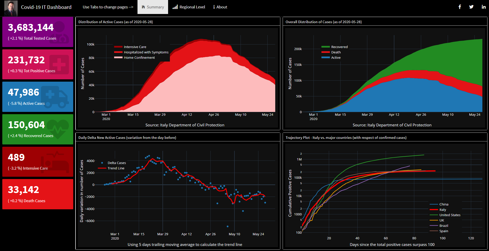
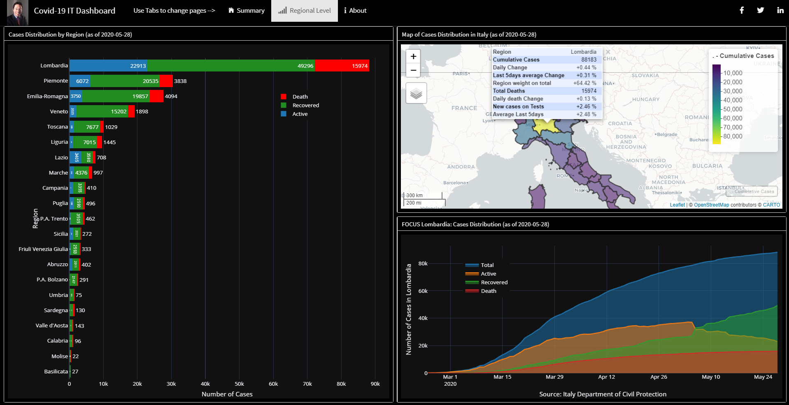

<!-- README.md is generated from README.Rmd. Please edit that file -->

### The Covid19 Italy Dashboard

**The Coronavirus Dashboard**

Ver. 1.1

This Covid19 Italy dashboard provides an overview of the 2019 Novel
Coronavirus COVID-19 (2019-nCoV) outbreak in Italy.

This is a first beta release built with R.

The aim of this dashboard is to provide an insight for the <b>business
decision-makers</b>, for that the next improvements will consider the
economic impacts and the scenario analysis with a <b>risk management</b>
point of view.

**To be updated please follow me on:**

  - Twitter: [pasqualemerella](https://twitter.com/pasqualemerella)
  - LinkedIn: [Pasquale Merella,
    FRM](https://www.linkedin.com/in/pasqualemerella/)
  - Instagram: [iPas](https://www.instagram.com/ipas/)

**Data source**

The code of this dashboard is forked from Rami Krispin’s GitHub
[repository](https://github.com/RamiKrispin/https://github.com/RamiKrispin/).

The raw data for this dashboard is pulled from Italy Department of Civil
Protection, and the coronavirus package from Johns Hopkins University
Center for Systems Science and Engineering (JHU CCSE). The data and
dashboard are refreshed on a daily basis.

For any question or feedback, please contact me via email
(<pasquale@merella.it>) or via social.

**Pasquale Merella, FRM**

Chief Risk Officer - Green Arrow Capital SGR

Senior Fellow
<a href="https://www.smartinstitute.org/" target="_blank">The Smart
Institute</a> think tank
