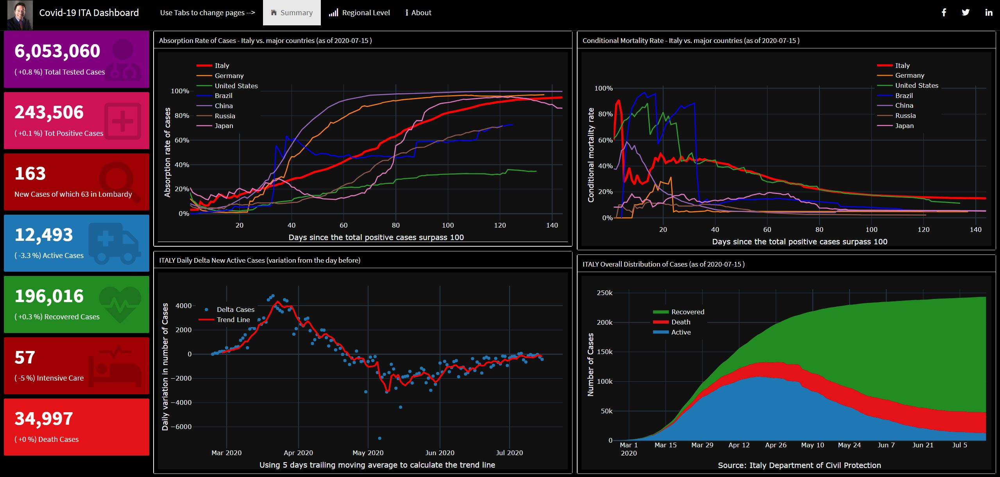
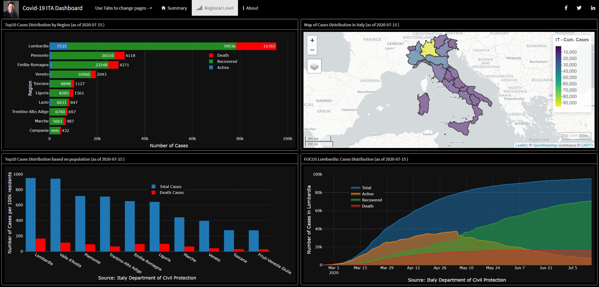

The Covid-19 Italy Dashboard
================

<!-- README.md is generated from README.Rmd. Please edit that file -->

  
 

**The Coronavirus Dashboard for
Italy**

– See the
[Changelog](https://github.com/pasmer/italy_dash/blob/master/CHANGELOG.md)
for more info.

This Covid19 Italy dashboard provides an overview of the 2019 Novel
Coronavirus COVID-19 (2019-nCoV) outbreak in Italy.

I built this dashboard with R then I deployed it in my personal R Shiny
Server to give evereybody access.

The aim of this dashboard is to provide an insight for the <b>business
decision-makers</b>, for that the next improvements will consider the
economic impacts and the scenario analysis with a <b>risk management</b>
point of view.

### Tab: Summary

  

### Tab: Regional Level

  

**To be updated please follow me on:**

  - Twitter: [pasqualemerella](https://twitter.com/pasqualemerella)
  - LinkedIn: [Pasquale Merella,
    FRM](https://www.linkedin.com/in/pasqualemerella/)
  - Instagram: [iPas](https://www.instagram.com/ipas/)

**Data source**

The code of this dashboard is forked by GitHub
<a href="https://github.com/RamiKrispin/" target="_blank">repository</a>
and the full code is on my
<a href="https://github.com/pasmer/italy_dash" target="_blank">GitHub
Repository</a>.

The raw data for this dashboard is pulled from Italy Department of Civil
Protection, and the coronavirus package from Johns Hopkins University
Center for Systems Science and Engineering (JHU CCSE). The data and
dashboard are refreshed on a daily basis.

For any question or feedback, please contact me via email
(<pasquale@merella.it>) or via social.

**Pasquale Merella, FRM**

Chief Risk Officer -
<a href="https://www.greenarrow-capital.com/" target="_blank">Green
Arrow Capital SGR</a>

Senior Fellow
<a href="https://www.smartinstitute.org/" target="_blank">The Smart
Institute</a> think tank
